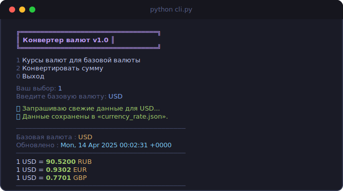
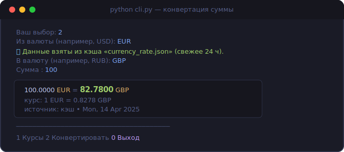

<div align="center">

# 💱 Currency Converter

**Консольный конвертер валют на Python с кэшированием и умным CLI**

[](https://www.python.org/)
[](https://open.er-api.com)
[](LICENSE)
[](.)

</div>

---

## ✨ Возможности

| Функция | Описание |
|---------|----------|
| 📈 **Курсы валют** | Получает актуальные курсы к любой базовой валюте |
| 💸 **Конвертация** | `сумма × курс` с точностью до 4 знаков |
| 📂 **Кэш 24 ч** | Не тратит лимиты API — читает из файла |
| ✅ **Валидация** | Проверяет коды валют, объясняет ошибки |
| 🌐 **Обработка сбоев** | Нет интернета / неверная валюта — понятные сообщения |

---

## 🖥️ Демо

### Режим 1 — курсы для базовой валюты



### Режим 2 — конвертация суммы



---

## 🗂️ Структура проекта

```
currency_converter/
│
├── api_client.py      # HTTP-слой: GET-запросы к open.er-api.com
├── storage.py         # I/O-слой: кэш в currency_rate.json (TTL 24 ч)
├── cli.py             # CLI-интерфейс: меню, ввод, вывод
│
├── assets/
│   ├── screenshot_rates.svg
│   └── screenshot_convert.svg
│
├── requirements.txt
└── README.md
```

---

## ⚡ Быстрый старт

```bash
# 1. Клонировать репозиторий
git clone https://github.com/YOUR_USERNAME/currency-converter.git
cd currency-converter

# 2. Создать виртуальное окружение
python -m venv venv

# 3. Активировать
source venv/bin/activate        # macOS / Linux
# venv\Scripts\activate         # Windows

# 4. Установить зависимости
pip install -r requirements.txt

# 5. Запустить
python cli.py
```

> **Требования:** Python 3.10+, пакет `requests`

---

## 📡 API

Используется **бесплатный** endpoint без ключа:

```
GET https://open.er-api.com/v6/latest/{base}
```

### Ключевые поля ответа

| Поле | Тип | Пример |
|------|-----|--------|
| `result` | string | `"success"` |
| `base_code` | string | `"USD"` |
| `time_last_update_utc` | string | `"Mon, 14 Apr 2025 00:02:31 +0000"` |
| `time_next_update_utc` | string | `"Tue, 15 Apr 2025 00:02:31 +0000"` |
| `conversion_rates` | object | `{"RUB": 90.52, "EUR": 0.93, …}` |

---

## 🧩 Архитектура

```
cli.py  ──▶  storage.py  ──▶  api_client.py  ──▶  open.er-api.com
              │
              └──▶  currency_rate.json  (кэш, TTL 24 ч)
```

**Логика кэширования:**

```python
if cache_exists and cache_age < 24h:
    return read_from_file()   # 📂 данные из кэша
else:
    data = get_currency_rates(base)
    save_to_file(data)        # 🌐 свежие данные
    return data
```

---

## 🔍 Обработка ошибок

```
❌ Ошибка сети: не удалось подключиться к серверу.
❌ Валюта «XYZ» не найдена (HTTP 404).
❌ «abc» — не число. Введите, например: 100 или 49.90
❌ Сервер вернул ошибку 429. Попробуйте позже.
```

Программа **никогда** не падает со стектрейсом — все исключения обработаны.

---

## 🎓 Учебный контекст

Проект выполнен в рамках урока **«Работа с API и форматы данных»**. Задачи:

- [x] Разобрать документацию `open.er-api.com`, выписать 5 ключевых полей
- [x] Написать корректный HTTP-клиент (f-строка URL, проверка статуса)
- [x] Реализовать кэш с TTL 24 ч (`json.dump` + `json.load`, `ensure_ascii=False`)
- [x] Мини-CLI: ввод, вывод курсов `RUB / EUR / GBP`
- [x] Конвертер суммы с 4 знаками после запятой
- [x] Валидация кодов из `conversion_rates.keys()`
- [x] Разделить на модули: `api_client.py` / `storage.py` / `cli.py`

---

<div align="center">

Сделано с ☕ и Python

</div>
